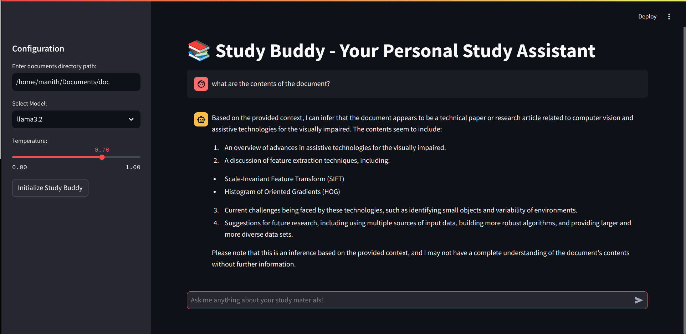

# Study Buddy - Personal Study Assistant


Study Buddy is an interactive AI-powered study assistant that helps users engage with their study materials through a chat interface. The application uses LangChain and Ollama to provide intelligent responses based on uploaded PDF documents.

## Features

- PDF document processing and analysis
- Interactive chat interface
- Support for multiple LLM models (llama2, mistral)
- Adjustable AI temperature settings
- Conversation memory
- Document embedding and semantic search

## Prerequisites

- Python 3.x
- Ollama installed and running on your system

## Installation

1. Clone the repository and install the required dependencies:

```bash
pip install streamlit langchain faiss-cpu pypdf python-magic-bin llamaindex
pip install langchain-community
pip install "unstructured[pdf]" python-magic
```

## Usage

1. Start the application:
```bash
streamlit run app.py
```

2. Configure the application:
   - Enter the directory path containing your PDF study materials
   - Select your preferred LLM model (llama2 or mistral)
   - Adjust the temperature setting for AI responses
   - Click "Initialize Study Buddy" to process your documents

3. Start chatting with Study Buddy about your study materials

## Configuration

The application allows you to configure:
- Document directory path
- LLM model selection (llama2 or mistral)
- AI temperature (0.0 - 1.0)

## Technical Stack

- Streamlit: Web interface
- LangChain: LLM framework
- FAISS: Vector store for document embeddings
- Ollama: LLM model provider
- DirectoryLoader: PDF document processing

## Project Structure

```
study-buddy/
├── app.py          # Main application file
├── requirements.txt # Project dependencies
└── README.md       # Project documentation
```

## Contributing

Contributions are welcome! Please feel free to submit a Pull Request.
